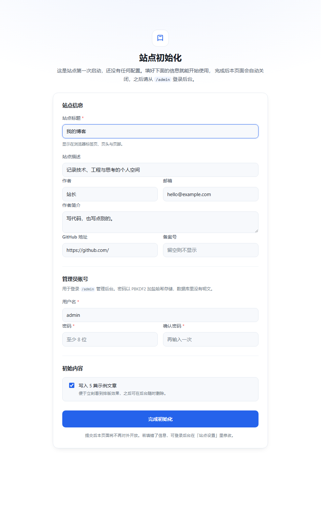
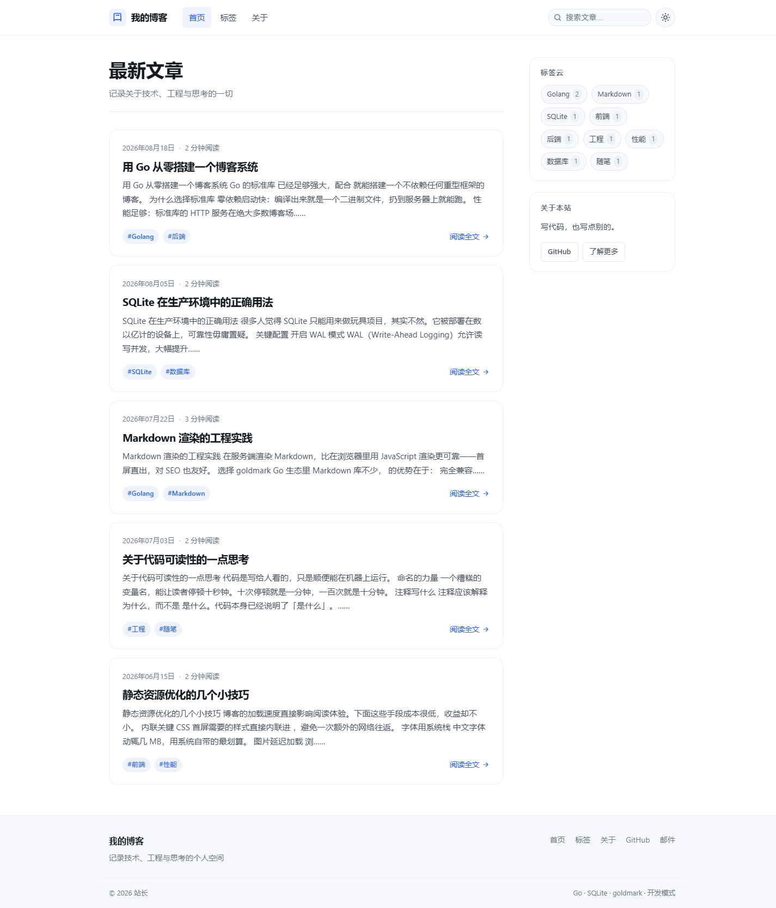
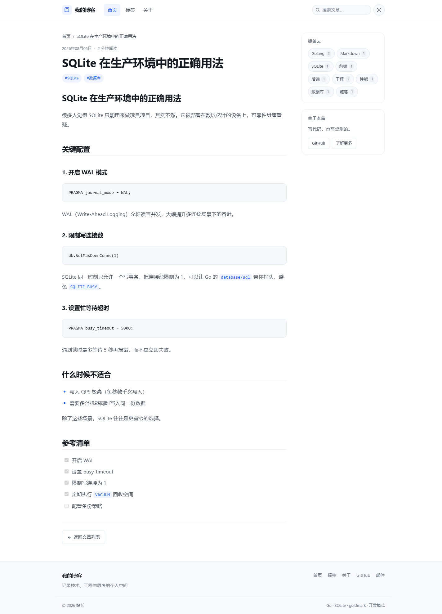
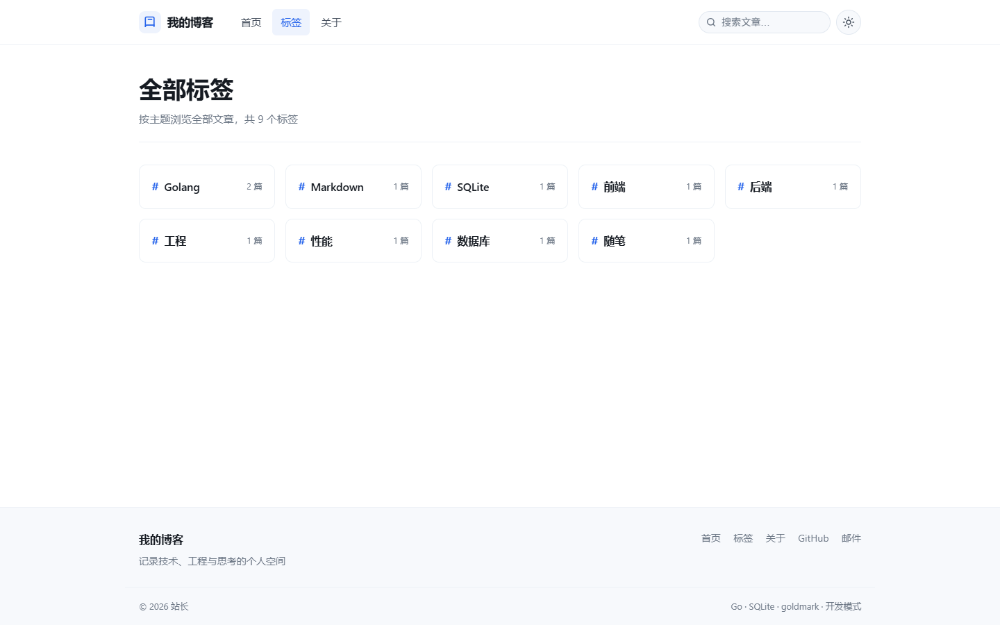
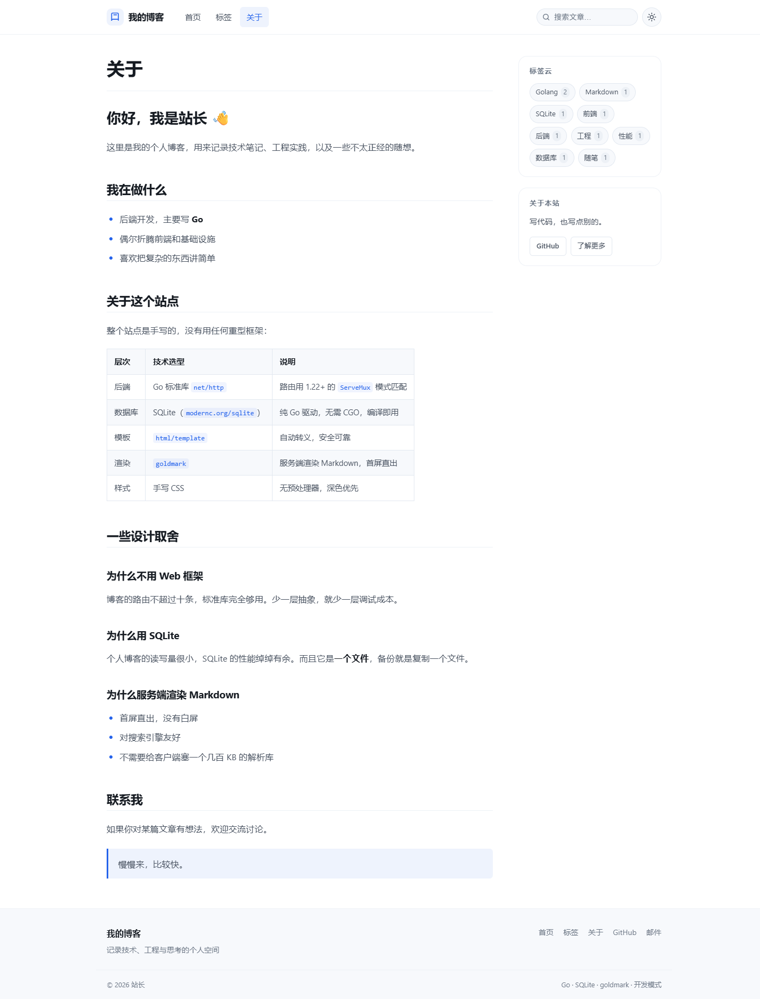
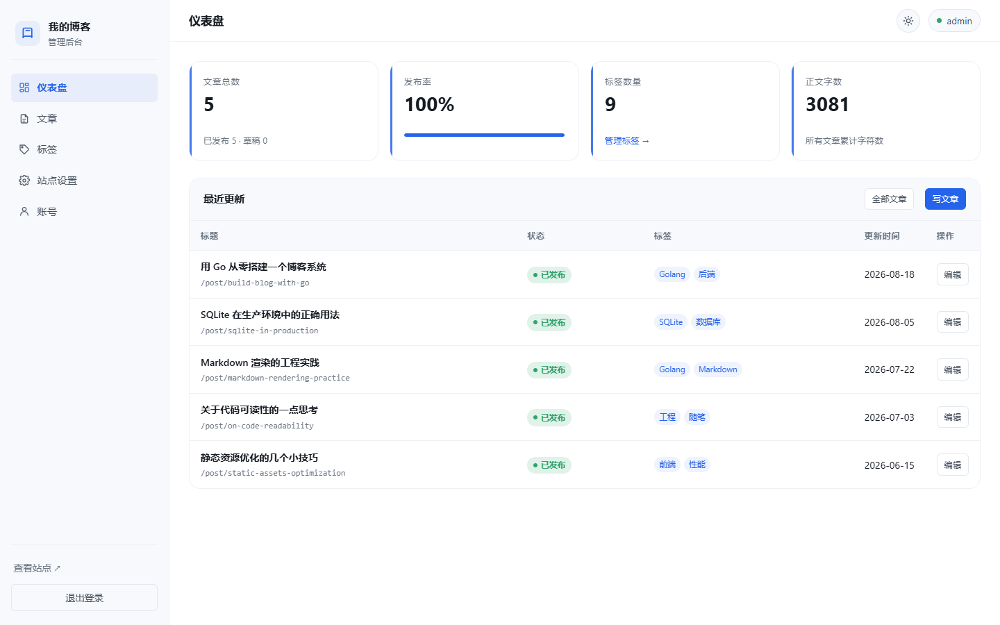
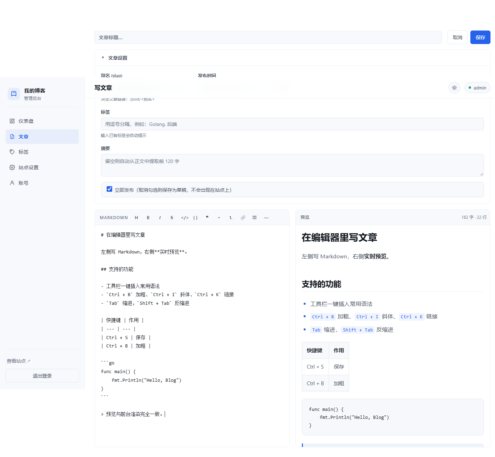
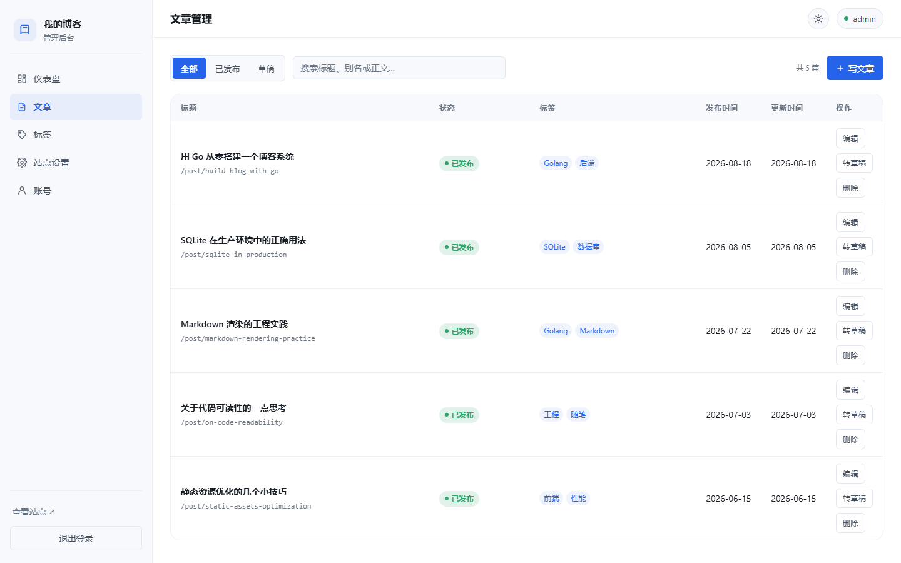
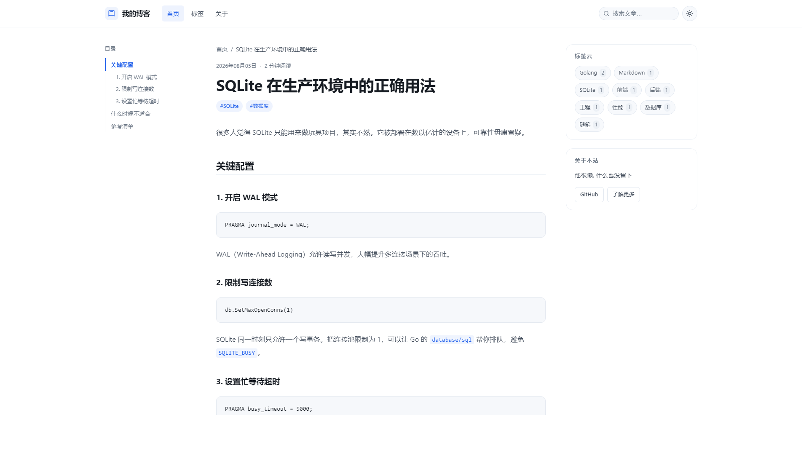
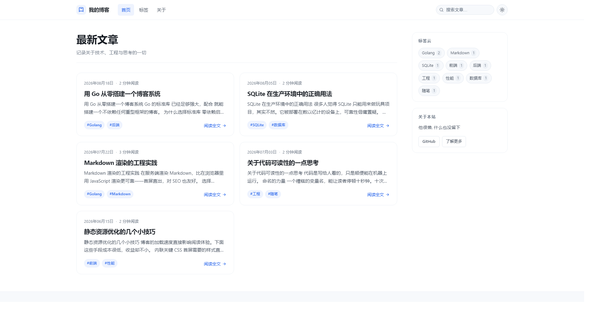

# 我的博客

一个用 Go 标准库 + SQLite 实现的个人博客系统，包含前台站点与可视化管理后台。

零前端构建、零 CGO 依赖，编译出来就是一个可执行文件。

> **声明**：本项目由 **Deepseek-V4.1-Flash** 完成。

## 界面预览

| 站点初始化（首次启动） | 前台首页 |
| --- | --- |
|  |  |

| 文章详情 | 标签总览 |
| --- | --- |
|  |  |

| 关于页面 | 后台登录（滑块拼图） |
| --- | --- |
|  |  |

| 后台仪表盘 | 后台编辑器 |
| --- | --- |
|  |  |

| 后台文章管理 | 宽屏 · 文章页（左侧目录） |
| --- | --- |
|  |  |

| 宽屏 · 首页（两栏卡片） |
| --- |
|  |

## 功能一览

### 前台站点

| 页面 | 路径 | 说明 |
| --- | --- | --- |
| 文章列表 | `/` | 分页展示已发布文章，侧边栏含标签云 |
| 文章详情 | `/post/{slug}` | 服务端渲染 Markdown，含标题锚点、代码复制、相关文章 |
| 标签总览 | `/tags` | 各标签及其文章数量（没有已发布文章的标签不显示） |
| 标签归档 | `/tag/{slug}` | 某标签下的文章，分页展示 |
| 关于页面 | `/about` | 内容来自 `content/about.md` |
| 搜索 | `/search?q=` | 标题、摘要、正文匹配 |
| 站点初始化 | `/init` | 首次启动时引导完成设置，初始化后自动关闭 |

其他特性：深色/浅色主题切换（跟随系统偏好并记忆选择）、响应式布局、`/` 快捷键聚焦搜索框、打印样式。

### 响应式布局

布局尺度随视口宽度分档放大（见 `static/css/tokens.css`），大屏下不会只留中间一条窄栏：

| 视口宽度 | 容器宽度 | 侧栏 | 布局 |
| --- | --- | --- | --- |
| < 1280px | 1080px | 268px | 内容 + 侧栏；≤ 960px 收起为单列 |
| ≥ 1280px | 1180px | 280px | 同上 |
| ≥ 1440px | 1310px | 296px | 文章页多出**左侧目录** |
| ≥ 1500px | （同 1440px） | — | 列表页改为两栏卡片 |
| ≥ 1680px | 1470px | 312px | 同上 |
| ≥ 1920px | 1640px | 328px | 正文字号提到 1.12rem |
| ≥ 2400px | 1800px | 344px | 正文字号提到 1.22rem |

容器宽度停在 1800px：再宽下去正文行长会超出舒适阅读区间，收益递减。所以超宽屏不是一味拉长文本，而是把多出来的横向空间用来：

- **文章页**：左侧生成文章目录（由渲染后的 h2/h3 自动提取，滚动时高亮当前小节）
- **列表页**：文章卡片改为两栏网格
- **字号**：同步放大，保证每行字数仍在舒适区间

目录仅在 ≥ 1440px 显示，且只在该文章有**至少 3 个**二/三级标题时才生成。

### 管理后台（`/admin`）

- **登录鉴权**：滑块拼图人机校验 + PBKDF2-HMAC-SHA256 加盐哈希 + 内存会话 + 登录失败限流
- **仪表盘**：文章总数、发布率、标签数、正文字数、最近更新与待完成草稿
- **文章管理**：列表筛选（全部/已发布/草稿）、关键词搜索、分页
- **文章编辑器**：左侧 Markdown 编辑、右侧实时预览、工具栏、快捷键、字数统计、离开提醒
- **发布控制**：一键发布/转草稿，草稿不会出现在站点上
- **标签管理**：重命名、修改别名、删除（可选连同文章删除）、清理空标签
- **站点设置**：站点标题、描述、作者、简介、GitHub、邮箱、ICP 备案号，保存后前台立即生效
- **账号设置**：修改用户名与密码，改密后强制所有会话重新登录

## 技术选型

| 层次 | 选型 | 说明 |
| --- | --- | --- |
| HTTP | `net/http` | 使用 Go 1.22+ 的 `ServeMux` 方法+通配符路由，无第三方框架 |
| 数据库 | `modernc.org/sqlite` | 纯 Go 实现的 SQLite 驱动，**无需 CGO**，交叉编译无痛 |
| 模板 | `html/template` | 自动上下文转义，模板在编译期校验 |
| Markdown | `github.com/yuin/goldmark` | CommonMark 兼容，GFM 扩展，自定义中文友好锚点 |
| 人机校验 | `image` + `image/jpeg` | 滑块拼图与字符验证码均由服务端程序化生成，不依赖字体文件或图形库 |
| 密码 | `crypto/pbkdf2` | Go 标准库，无额外依赖 |
| 前端 | 原生 CSS/JS | 无构建步骤，无 CDN 依赖 |

第三方依赖只有两个（`goldmark` 与 `sqlite` 驱动），其余全部来自标准库。

## 快速开始

```bash
# 1. 编译
go build -o blog.exe .

# 2. 启动（前台 http://localhost:18080，后台 http://localhost:18080/admin）
./blog.exe serve
```

首次启动时数据库是空的，站点处于**未初始化**状态：访问任何页面（包括 `/admin`）都会引导到 `/init`。

### 站点初始化

在 `/init` 页面上填写站点信息与管理员账号，一次完成初始化：

| 分组 | 字段 |
| --- | --- |
| 站点信息 | 标题（必填）、描述、作者、邮箱、简介、GitHub 地址、备案号 |
| 管理员账号 | 用户名（必填）、密码（至少 8 位，需确认一次） |
| 初始内容 | 「写入 5 篇示例文章」复选框，默认勾选 |

提交后会：

1. 写入站点设置，创建管理员账号（密码以 PBKDF2 加盐哈希存储）
2. 标记站点为已初始化，**`/init` 随即对外关闭**（再访问会 302 回首页）
3. 跳转到 `/admin/login` 登录

几个细节：

- 表单有 CSRF 防护，密码**不会**回显到 HTML 里
- 标题、描述等字段限长 200 字，邮箱与 GitHub 地址会做格式校验
- 「写入示例文章」只在文章表为空时出现；已有文章时该选项自动隐藏
- 初始化前静态资源与 `/healthz` 不受影响，所以初始化页面本身能正常加载样式

**「已初始化」是怎么判定的**：以数据库中的 `site_initialized` 标记为准；此外，**只要数据库里已经存在管理员账号，也视为已初始化**——这样从旧版本升级上来的库不会被突然要求重新初始化一遍。

判定条件刻意没用「设置表里有没有内容」，因为那个条件太脆弱：任何一条默认值写进去就会成立。

### 启动参数

```bash
./blog.exe serve \
  -addr :18080 \                   # 监听地址（默认 :18080）
  -db data/blog.db \               # 数据库文件
  -about content/about.md \        # 关于页内容
  -admin-user admin \              # 预填初始化表单里的管理员用户名
  -captcha slider \                # 登录人机校验：slider | image | off
  -dev                             # 开发模式：禁用静态资源缓存
```

> 管理员密码不在命令行或环境变量里设置，而是在 `/init` 页面填写——避免明文密码出现在
> 进程列表（`ps`）和 systemd 单元文件里。

`-captcha` 控制后台登录的人机校验方式，默认 `slider`：

| 取值 | 说明 |
| --- | --- |
| `slider` | 拖动滑块完成拼图（默认） |
| `image` | 输入图形字符验证码 |
| `off` | 关闭，仅建议在内网或本地开发时使用 |

也支持环境变量：`BLOG_ADDR`、`BLOG_DB`、`BLOG_ABOUT`、`BLOG_ADMIN_USER`、`BLOG_CAPTCHA`、`BLOG_TITLE`、`BLOG_AUTHOR`、`BLOG_DESCRIPTION`、`BLOG_BIO`、`BLOG_GITHUB`、`BLOG_EMAIL`、`BLOG_ICP`。

`BLOG_TITLE` 等站点信息只用于**预填初始化表单**，真正生效的是你在页面上提交的值；初始化完成后这些环境变量不再有影响，改动请到后台「站点设置」。

## 写文章

有两种方式，可以混用。

### 方式一：管理后台

浏览器打开 `/admin`，登录后点击「写文章」。编辑器提供实时预览、工具栏与快捷键（`Ctrl/Cmd + B` 加粗、`I` 斜体、`K` 链接、`S` 保存、`Tab` 缩进）。

### 方式二：Markdown 文件导入

在 `posts/` 目录放 Markdown 文件，然后执行：

```bash
./blog.exe import posts
```

文件格式：

```markdown
---
title: 文章标题
slug: my-post
date: 2026-09-01 10:30
tags: Golang, 后端
summary: 可选，留空会自动从正文提取
draft: false
---

# 正文标题

正文内容…
```

字段说明：

| 字段 | 必填 | 说明 |
| --- | --- | --- |
| `title` | 否 | 留空则取正文第一个一级标题，再回退到文件名 |
| `slug` | 否 | 留空则由标题生成，支持中文 |
| `date` | 否 | 支持 `2006-01-02`、`2006-01-02 15:04`、RFC3339 等格式 |
| `tags` | 否 | 逗号分隔，或 `[a, b]` 形式，中英文逗号均可 |
| `summary` | 否 | 留空自动截取正文前 120 字 |
| `draft` | 否 | `true` 表示草稿，站点上不可见 |

导入是**幂等**的：同一个 `slug` 重复导入会更新而不是新建。文件名以下划线或点开头的会被跳过。

也可以把数据库中的文章导回文件：

```bash
./blog.exe export posts-export
```

## 部署到 Linux

项目是纯 Go 实现（`modernc.org/sqlite` 不需要 CGO），在 Windows / macOS 上可以直接交叉编译出 Linux 二进制，**不需要 Docker、虚拟机或 Linux 环境**。

### 交叉编译

```bash
make linux        # 产出 dist/blog-linux-amd64
make all          # 一次编译 Linux / Windows / macOS
make dist         # 生成带 systemd 单元的发布包
```

不用 `make` 的话：

```bash
CGO_ENABLED=0 GOOS=linux GOARCH=amd64 go build -trimpath \
  -ldflags "-s -w -X main.version=1.0.0" -o dist/blog-linux-amd64 .
```

产物是**完全静态链接**的 ELF（无 `PT_INTERP`、无 `.dynamic` 节），不依赖 glibc，Alpine 等 musl 发行版也能直接运行。用 `./blog-linux-amd64 version` 可打印版本与构建目标平台。

### 安装

```bash
# 1. 上传并解压（包内已带可执行位，无需 chmod）
scp dist/blog-linux-amd64.tar.gz user@server:/tmp/
ssh user@server
sudo tar -xzf /tmp/blog-linux-amd64.tar.gz -C /opt

# 2. 建立专用系统用户与数据目录
sudo useradd --system --no-create-home --shell /usr/sbin/nologin blog
sudo mkdir -p /opt/blog/data
sudo chown -R blog:blog /opt/blog

# 3. 配置站点环境变量（权限 600，含密钥，不要写进 systemd 单元）
sudo install -d -m 750 /etc/blog
sudo install -m 600 /opt/blog/blog.env.example /etc/blog/blog.env
sudo nano /etc/blog/blog.env

# 4. 注册为系统服务
sudo cp /opt/blog/blog.service /etc/systemd/system/
sudo systemctl daemon-reload
sudo systemctl enable --now blog
journalctl -u blog -f
```

首次启动会自动建表，此时站点处于**未初始化**状态，日志里会提示：

```
level=WARN msg="站点尚未初始化，请访问初始化页面完成设置" url=http://localhost:18080/init
```

浏览器打开 `http://<服务器地址>/init`（或经反向代理后的域名），填写站点信息与管理员账号即可。
初始化完成后 `/init` 立即关闭，之后从 `/admin` 登录。

> 由于初始化需要浏览器操作，建议先直接访问一次完成设置，再配好 Nginx 与 HTTPS。
> 如果服务器只能通过跳板访问，可以临时用 `ssh -L 18080:127.0.0.1:18080 user@server` 做端口转发，
> 在本地浏览器打开 `http://127.0.0.1:18080/init`。
>
> 忘记密码时可以删掉库里的账号记录让程序重建（下次访问 `/init` 会重新要求初始化）：
>
> ```bash
> sqlite3 /opt/blog/data/blog.db \
>   "DELETE FROM settings WHERE key IN ('admin_username','admin_password_hash','site_initialized');"
> sudo systemctl restart blog
> ```

### 反向代理

服务默认只监听 `127.0.0.1:18080`，建议由 Nginx 终结 TLS：

```nginx
server {
    listen 443 ssl http2;
    server_name example.com;

    ssl_certificate     /etc/letsencrypt/live/example.com/fullchain.pem;
    ssl_certificate_key /etc/letsencrypt/live/example.com/privkey.pem;

    # 放在 server 级别，下面所有 location 都会继承
    proxy_set_header Host              $host;
    proxy_set_header X-Real-IP         $remote_addr;
    proxy_set_header X-Forwarded-For   $proxy_add_x_forwarded_for;
    proxy_set_header X-Forwarded-Proto $scheme;

    location / {
        proxy_pass http://127.0.0.1:18080;
    }

    # 建议额外限制后台来源，减少暴露面
    # 注意：location 里不要再写 proxy_set_header —— 一旦写了，上面继承来的头会被全部覆盖
    location /admin {
        allow 203.0.113.0/24;   # 改成你自己的出口 IP
        deny  all;
        proxy_pass http://127.0.0.1:18080;
    }
}
```

> `X-Forwarded-Proto` 必须透传：程序靠它（或 `r.TLS`）决定会话 Cookie 是否加 `Secure` 标记。反代下漏了它，Cookie 就不会带 `Secure`。

> ⚠️ **登录限流的已知限制**：限流按客户端 IP 计数，而当前实现只读取 TCP 层的 `RemoteAddr`，**不解析 `X-Forwarded-For`**。因此放在反向代理后面时，所有访客会被算作同一个来源，限流会误伤正常用户。
>
> 目前建议的应对方式：用上面的 `location /admin` 做来源 IP 白名单；或在 Nginx 层加 `limit_req` 做请求频率限制。若需要程序内按真实 IP 限流，需要加一个「信任代理」开关（默认关闭，否则伪造 `X-Forwarded-For` 就能绕过限流）。

### 备份

SQLite 已开启 WAL，运行中直接 `cp` 可能拿到不一致的快照。用在线备份更稳妥：

```bash
sqlite3 /opt/blog/data/blog.db ".backup '/backup/blog-$(date +%F).db'"
```

或先 `systemctl stop blog` 再复制 `blog.db`（连同 `-wal`、`-shm` 一起）。

### 升级

二进制是自包含的（模板与静态资源已编译进去），升级只需替换文件：

```bash
sudo systemctl stop blog
sudo cp /opt/blog/data/blog.db /backup/blog-$(date +%F).db   # 先备份
sudo cp blog-linux-amd64 /opt/blog/ && sudo chown blog:blog /opt/blog/blog-linux-amd64
sudo systemctl start blog
```

数据库结构变更走的是 `CREATE TABLE IF NOT EXISTS`，不会丢数据。

## 项目结构

```
blog/
├── main.go                      # 入口：serve / import / export / version 子命令
├── internal/
│   ├── admin/                   # 管理后台
│   │   ├── admin.go             #   路由、初始化门控、登录 CSRF
│   │   ├── handlers.go          #   各页面处理器
│   │   ├── middleware.go        #   会话、鉴权、提示消息
│   │   └── render.go            #   模板加载与页面数据结构
│   ├── auth/                    # 密码哈希、会话管理、登录限流
│   ├── captcha/                 # 人机校验：滑块拼图 + 字符验证码（均为程序化生成图片）
│   ├── content/                 # front matter 解析
│   ├── markdown/                # Markdown 渲染与摘要提取
│   ├── models/                  # 数据模型
│   ├── setup/                   # 站点初始化状态（前台后台共享）
│   ├── site/                    # 站点配置（数据库设置 + 默认值回退）
│   ├── store/                   # SQLite 数据访问层
│   │   ├── store.go             #   连接、建表、迁移
│   │   ├── seed.go              #   示例文章
│   │   ├── post.go / tag.go     #   前台查询
│   │   ├── admin.go             #   后台查询与统计
│   │   ├── settings.go          #   设置读写与初始化标记
│   │   └── write.go             #   文章写入
│   └── web/                     # 前台站点
│       ├── server.go            #   路由、渲染与初始化门控
│       ├── init.go              #   站点初始化页面与表单校验
│       ├── handlers.go          #   页面处理器 + 目录提取
│       └── render.go            #   模板加载与分页
├── templates/
│   ├── *.html                   # 前台模板
│   ├── init.html                # 站点初始化页（独立布局）
│   └── admin/*.html             # 后台模板
├── static/
│   ├── css/
│   │   ├── tokens.css           #   设计变量（前台后台共用）
│   │   ├── prose.css            #   Markdown 排版（前台后台共用）
│   │   ├── style.css            #   前台组件
│   │   └── admin.css            #   后台组件
│   ├── js/app.js                # 前台脚本
│   ├── js/admin.js              # 后台脚本（编辑器、预览）
│   └── favicon.svg
├── content/about.md             # 关于页内容
└── data/blog.db                 # SQLite 数据库（运行时生成）
```

模板与静态资源通过 `go:embed` 编译进二进制。**如果运行目录下存在同名的 `templates/` 或 `static/` 文件夹，则优先使用磁盘版本**，改样式无需重新编译。

## 数据库

三张表加一张设置表：

```sql
posts      (id, title, slug, summary, content, published, created_at, updated_at)
tags       (id, name, slug)
post_tags  (post_id, tag_id)          -- 多对多，级联删除
settings   (key, value)               -- 站点配置与管理员账号
```

SQLite 已启用 WAL 模式、`busy_timeout` 与连接池写限制，兼顾并发读取与写入安全。

备份就是复制 `data/blog.db` 一个文件；把内容放在 `posts/*.md` 并用 Git 管理，则是更稳妥的做法。

## 安全说明

- 后台登录默认开启**滑块拼图人机校验**，校验在密码校验之前完成，失败同样计入限流
- 密码使用 PBKDF2-HMAC-SHA256（12 万次迭代）加随机盐哈希存储，数据库中没有明文
- 用户名与密码校验均使用恒定时间比较，避免时序侧信道
- 所有后台写操作校验 CSRF 令牌；登录表单每次渲染都换发新令牌（写进 `HttpOnly` Cookie），滑块校验接口复用同一令牌、经 `X-CSRF-Token` 请求头传递
- 同一来源连续 8 次登录失败会锁定 10 分钟
- 会话 Cookie 设置 `HttpOnly` + `SameSite=Lax`，HTTPS 下自动加 `Secure`
- 后台页面带 `X-Robots-Tag: noindex`，不会被搜索引擎收录
- 登录后的跳转目标限制为站内路径，避免开放重定向

### 滑块拼图是怎么做的

背景图与拼图块都由服务端**程序化生成**，不依赖任何图片素材、字体或图形库：

1. 先画一张对角多段渐变，叠上若干半透明圆形与细圆环，得到有足够局部纹理的底图
2. 在随机位置抠出一个「正方形 + 顶边圆形凸起」的拼图块，并在底图上把该区域压暗成缺口
3. 底图以 JPEG 下发（平滑渐变用 PNG 会膨胀到 30KB+，JPEG 只要 5KB），拼图块用 PNG 保留透明
4. 前端拖动对齐后，把拼图块所在的**原图像素坐标**连同拖动轨迹一起上报

判定规则：

- 水平误差不超过 ±5px（320px 宽的底图里横向约 270 个落点）
- 拖动时长需在 300ms ~ 20s 之间，采样点不少于 5 个，且不能出现「一步跳到终点」
- 每个挑战最多 3 次机会，用尽即作废；通过后签发一张 3 分钟内有效、**一次性**且**绑定来源地址**的票据
- 滑块失败**不**计入登录失败次数，避免手滑几次就把账号锁死；滑块接口另有独立的请求频率限制

### 关于滑块验证码的安全边界（请务必了解）

滑块拼图能拦住脚本化的暴力尝试，但**拦不住会做图像处理的攻击者**。原因很直接：缺口必须是肉眼可见的，否则用户也没法完成拼图，而可见的缺口同样能被算法找到。

我在开发过程中实测验证了这一点：用一段几十行的代码扫描底图亮度，就能稳定定位缺口并一次通过校验。所以请不要把滑块验证码当作强安全边界。

它真正的作用是**抬高自动化攻击的成本**，实际防护效果来自这几层叠加：

| 防线 | 作用 |
| --- | --- |
| 滑块拼图 | 拦住直接 POST 表单的简易脚本，迫使攻击者先取图并做图像分析 |
| 登录限流 | 每来源 10 分钟最多 8 次失败，从根本上限制爆破速率 |
| PBKDF2 加盐哈希 | 即使数据库泄露也难以反推密码 |
| 密码强度 | **这才是最关键的一层** |

如果你需要更强的防护，建议改用第三方专业验证服务。

### 字符验证码模式

`-captcha image` 可切回字符验证码：服务端用手写 5×7 点阵字模绘制 PNG，字符集为 `34679ACDEFGHJKMNPQRTUVWXY`（刻意剔除 `0/O`、`1/I/L`、`2/Z`、`5/S`、`8/B` 等易混淆字符），答案只存服务端内存，每个验证码只能校验一次。

### 部署前检查

- 完成 `/init` 初始化，并设置足够长的管理员密码
- 通过 Nginx 配置 HTTPS，并按「反向代理」一节透传请求头
- 限制 `/admin` 的访问来源 IP，减少暴露面

## 已知边界

- 会话保存在进程内存中，服务重启后需要重新登录；多实例部署需要换成外部存储
- **登录限流只按 TCP 层的 `RemoteAddr` 计数，不解析 `X-Forwarded-For`**。放在反向代理后面时所有访客会被算作同一来源，需在 Nginx 层限制 `/admin` 来源 IP（详见「部署到 Linux → 反向代理」）
- 会话 Cookie 的 `Secure` 标记依赖请求是否为 HTTPS；经反向代理时若未透传 `X-Forwarded-Proto`，程序会认为仍是 HTTP
- Markdown 渲染开启了 `WithUnsafe()` 以支持内嵌 HTML，因此**后台账号等同于完全可信**，不要开放给他人
- 搜索使用 `LIKE` 模糊匹配，文章量达到数万篇时建议换成 SQLite FTS5
- 未提供图片上传，配图需要自行使用外链

## 许可证

本项目采用 [MIT 许可证](LICENSE) 发布，版权归 © 2026 tmiqpl 所有。

本项目由 **Deepseek-V4.1-Flash** 完成。
